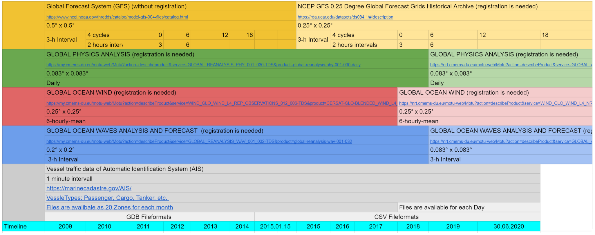

# MariDataHarvest

## TODOS

- [x] List only required/directly used dependencies in `dev` branch without versions, unless they are required in THIS version.
      Split `requirements.txt` and list only directly used ones.
  - [x] EnvironmentalData
  - [x] Harvester
  - [x] EnvDataServer
- [ ] Solve context path problem (via configuration or similar)
- [ ] Code-Cleaning: Remove unused imports, functions, variables
- [ ] Establish central location for variable definition: keep in weather.py; EnvDataServer/app.py accesses them via python features;  page.js accesses theme via light weight endpoint implemented in app.py
      Convert to dictionary and provide helper functions to retrieve the required representation

- [ ] Establish `dev` branch

- [ ] Add Package/Component Overview to root `README.md`
      Document, who is using what part of the utilities package.
- [ ] Comment wind variable in webui (and API)
      page.js:95 comment
      EnvDataServer/app.py:159 remove Wind from list of variables if not configurable

- [ ] WebUI: set time bbox to current day (limit input to hours only, no minutes, if easily possible)
- [ ] Store last request in cookie or Browser-Storage
- [ ] History Back does not work

- [ ] Replace MOTU bei OPeNDAP
- [ ] `Dockerfile` of harvester:
  - [ ] reuqirements.txt -> new name
  - [ ] copy package and the dependency packages (utilities, environmentData)
  - [ ] adjust `CMD` to match new python package structure
    - [ ] add env pythonpath
    - [ ] change CMD to variant with "[" s
- [ ] Identify useful k8s/proxy timeout or switch to asynchronous communication pattern with managed request queue

## Description

MariDataHarvest is a tool for scrapping and harvesting Automatic Identification System (AIS) data provided by [marinecadastre](https://marinecadastre.gov/AIS/)
then appending it with the weather and environment conditions provided by [CMEMS](https://nrt.cmems-du.eu) and [RDA](https://rda.ucar.edu/index.html) at each geographical and UTC timestamp point.
In the following is a description of the datasets used:

- <details>
  <summary>Datasets Description</summary>

  [](https://docs.google.com/spreadsheets/d/1GxcBtnaAa2GQDwZibYFbWPXGi7BPpPdYLZwyetpsJOQ/edit?usp=sharing)

  </details>

- <details>
  <summary>Variables Description</summary>

  [](https://docs.google.com/spreadsheets/d/1GxcBtnaAa2GQDwZibYFbWPXGi7BPpPdYLZwyetpsJOQ/edit?usp=sharing)

  </details>

This tool is developed with in the [MariData](https://www.maridata.org) project.

## Requirements

MariDataHarvest requires **python 3** and **pip** to run. You can install all python requirements with the following command:

```sh
pip install -r requirements.txt
```

For a detailed list, see section License below.

## Usage

The script requires accounts for the following webservices:

- [CMEMS](https://resources.marine.copernicus.eu/?option=com_csw&task=results?option=com_csw&view=account)
- [RDA](https://rda.ucar.edu/index.html?hash=data_user&action=register)

The credentials of these services MUST be entered into a file called `.env.secret` as outlined here:

   ```sh
   UN_CMEMS=
   PW_CMEMS=
   UN_RDA=
   PW_RDA=
   ```

Start harvesting with the following command:

```sh
python main.py --year=2019 --minutes=30 --dir=C:\..
```

- `year`: the year(s) to download AIS-data. Expected input a year 'YYYY' , a range of years 'YYYY-YYYY' or multiple years 'YYYY,YYYY,YYYY'.

- `minutes`: is the sub-sampling interval in minutes.

- `dir`: the absolute path where to keep data. If empty, the directory is same as the project directory.

- **optional** arguments:

  - `step`: starts the script at a specific step:

    1. Download,
    2. Subsample,
    3. Appending weather data.

    If `step` equals `0` (default value), the script runs all steps starting from step 1.

  - `clear`: clears files of `year` ONLY after step 2 is done.

  - `depth_first`: runs all steps for each file, which automatically deactivates `step` argument.

## Development

Start the EnvDataAPI services locally for testing using the following command in the `EndDataServer` directory:

```shell
export FLASK_APP=app.py
flask run --debugger
```

## Docker

You can use the [Dockerfile](./Dockerfile) to build a docker image and run the script in its own isolated environment. It is recommended to provide a volume to persist the data between each run. You can specify all arguments including the optional ones as environment variables when creating/starting the container as outlined in the following. The labels used are following the [Image And Container Label Specification](https://wiki.52north.org/Documentation/ImageAndContainerLabelSpecification) of 52°North.

1. Build:

   ```sh
   docker build \
      --build-arg GIT_COMMIT=$(git rev-parse -q --verify HEAD) \
      --build-arg BUILD_DATE=$(date -u +"%Y-%m-%dT%H:%M:%SZ") \
      --file Dockerfile.harvester \
      -t 52north/mari-data_harvester:1.0.0 .
   ```

   Ensure, that the version of the image tag is matching the version in the Dockerfile, here: `1.0.0`.

1. Create named volume:

   ```sh
   docker volume create \
      --label org.52north.contact=dev-opser+mari-data_harvester@example.org \
      --label org.52north.context="MariData Project: Data Harvesting Script" \
      --label org.52north.end-of-life=$(date -d "+365 days" -u +"%Y-%m-%dT%H:%M:%SZ") \
      mari-data-harvester_data
   ```

1. Run:

   ```sh
   docker run \
      --label org.52north.contact=dev-opser+mari-data_harvester@example.org \
      --label org.52north.context="MariData Project: Data Harvesting Script" \
      --label org.52north.end-of-life=$(date -d "+365 days" -u +"%Y-%m-%dT%H:%M:%SZ") \
      --label org.52north.created='$(date -u +"%Y-%m-%dT%H:%M:%SZ")' \
      --volume mari-data-harvester_data:/mari-data/data \
      --volume .env.secret:/mari-data/EnvironmentalData/.env.secret:ro \
      --env-file docker.env \
      --name=mari-data_harvester \
      --detach \
      52north/mari-data_harvester:1.0.0 \
      && docker logs --follow mari-data_harvester
   ```

   with `docker.env` containing the following information:

   ```sh
   YEAR=2015-2021
   MINUTES=5
   DATA_DIR=/mari-data/data
   STEP=0
   DEPTH_FIRST=--depth-first
   CLEAR=--clear
   ```

## Deployment

Use the following command to send the code to any server for building the image (or clone this repository using `git clone...`) and run it:

```sh
rsync --recursive --verbose --times --rsh ssh \
   --exclude='AIS-DATA' --exclude='*.tmp' \
   --exclude='*.swp' --exclude='.vscode' \
   --exclude='__pycache__' --delete . \
   mari-data-harvester.example.org:/home/user/mari-data-harvester
```

### Web Access to the Data

We are using an nginx container to provide web access to the generated data. It requires an external service to maintain the ssl certificates. The according data volume is mounted read-only and externally provided, hence docker-compose does not create it with a project prefix.

Just execute the following command in root folder of the repository to start the service:

```sh
docker-compose up -d --build && docker-compose logs --follow
```

The data is available directly at the server root via https. All requests to http are redirected to https by default.

## Contact

- [Zaabalawi, Sufian](https://github.com/SufianZa)
- [Jürrens, Eike Hinderk](https://github.com/EHJ-52n)

## License

- [ ] Add License Header to source files

| Name            | Version   | License                                             |
|-----------------|-----------|-----------------------------------------------------|
| Fiona           | 1.8.18    | BSD License                                         |
| Flask           | 1.1.2     | BSD License                                         |
| Flask-Limiter   | 1.4       | MIT License                                         |
| GDAL            | 3.2.2     | MIT                                                 |
| Jinja2          | 2.11.3    | BSD License                                         |
| MarkupSafe      | 1.1.1     | BSD License                                         |
| PyYAML          | 5.4.1     | MIT License                                         |
| Shapely         | 1.7.1     | BSD License                                         |
| Werkzeug        | 1.0.1     | BSD License                                         |
| attrs           | 20.3.0    | MIT License                                         |
| beautifulsoup4  | 4.9.3     | MIT License                                         |
| bs4             | 0.0.1     | MIT License                                         |
| certifi         | 2020.12.5 | Mozilla Public License 2.0 (MPL 2.0)                |
| cftime          | 1.4.1     | MIT License                                         |
| chardet         | 4.0.0     | GNU Library or Lesser General Public License (LGPL) |
| click           | 7.1.2     | BSD License                                         |
| click-plugins   | 1.1.1     | BSD License                                         |
| cligj           | 0.7.1     | BSD                                                 |
| cloudpickle     | 1.6.0     | BSD License                                         |
| dask            | 2021.4.0  | BSD License                                         |
| fsspec          | 0.9.0     | BSD License                                         |
| geopandas       | 0.9.0     | BSD                                                 |
| idna            | 2.10      | BSD License                                         |
| itsdangerous    | 1.1.0     | BSD License                                         |
| joblib          | 1.0.1     | BSD License                                         |
| limits          | 1.5.1     | MIT License                                         |
| locket          | 0.2.1     | BSD License                                         |
| motuclient      | 1.8.8     | GNU Lesser General Public License v3 (LGPLv3)       |
| munch           | 2.5.0     | MIT License                                         |
| netCDF4         | 1.5.6     | MIT License                                         |
| numpy           | 1.20.1    | BSD License                                         |
| pandas          | 1.2.3     | BSD                                                 |
| partd           | 1.2.0     | BSD                                                 |
| protobuf        | 3.15.6    | 3-Clause BSD License                                |
| pyproj          | 3.0.1     | MIT License                                         |
| python-dateutil | 2.8.1     | BSD License, Apache Software License                |
| python-dotenv   | 0.15.0    | BSD License                                         |
| pytz            | 2021.1    | MIT License                                         |
| requests        | 2.25.1    | Apache Software License                             |
| scikit-learn    | 0.24.2    | new BSD                                             |
| scipy           | 1.6.1     | BSD License                                         |
| siphon          | 0.9       | BSD License                                         |
| six             | 1.15.0    | MIT License                                         |
| soupsieve       | 2.2.1     | MIT License                                         |
| threadpoolctl   | 2.1.0     | BSD License                                         |
| toolz           | 0.11.1    | BSD License                                         |
| urllib3         | 1.26.4    | MIT License                                         |
| waitress        | 2.0.0     | Zope Public License                                 |
| wget            | 3.2       | Public Domain                                       |
| xarray          | 0.17.0    | Apache Software License                             |

<details>
<summary>generate license list</summary>

```sh
docker run --rm --interactive --tty 52north/mari-data_harvester:1.0.0 /bin/bash \
   -c "pip install --no-warn-script-location --no-cache-dir pip-licenses > /dev/null && .local/bin/pip-licenses -f markdown"
```

</details>

## Funding

| Project/Logo | Description |
| :-------------: | :------------- |
| [](https://www.maridata.org/) | MariGeoRoute is funded by the German Federal Ministry of Economic Affairs and Energy (BMWi)[](https://www.bmvi.de/) |
